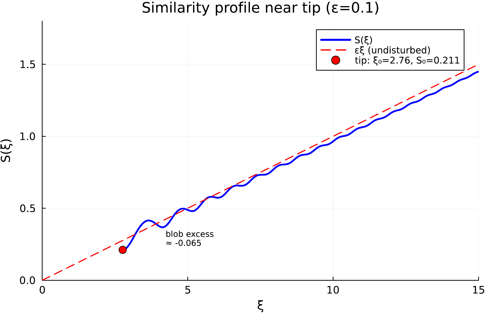
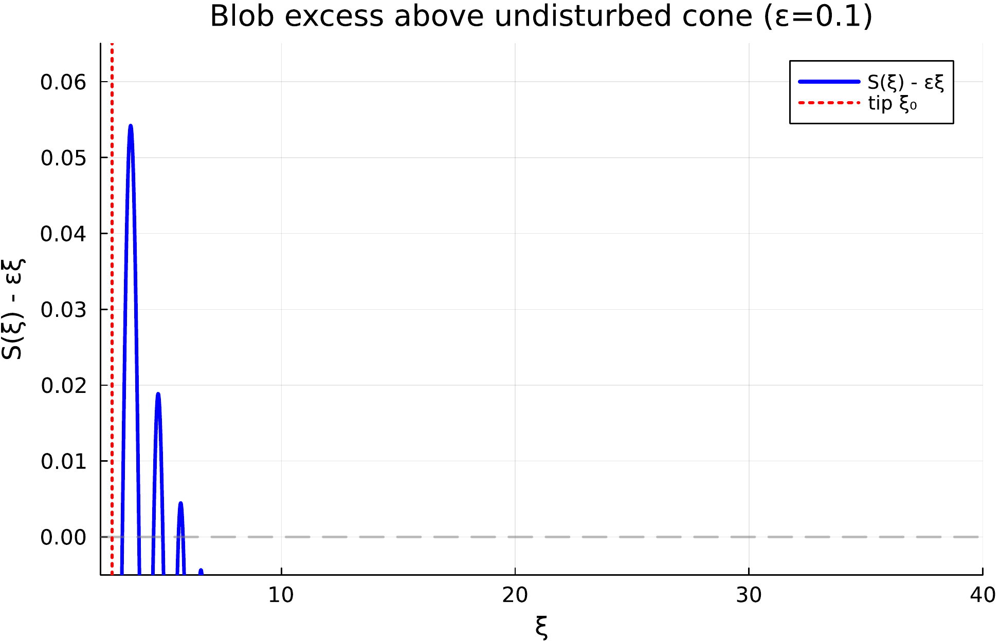
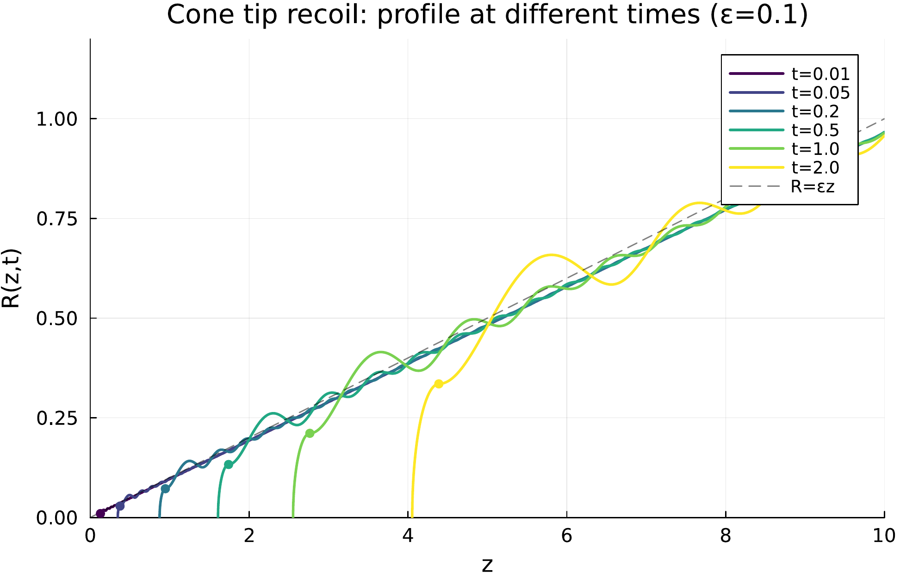
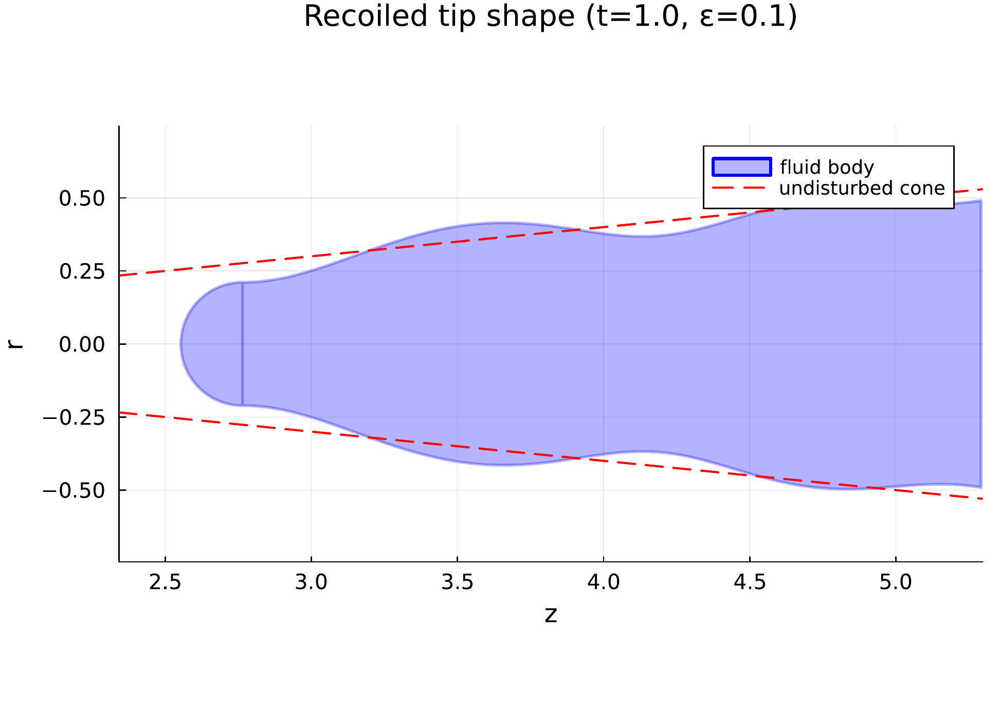
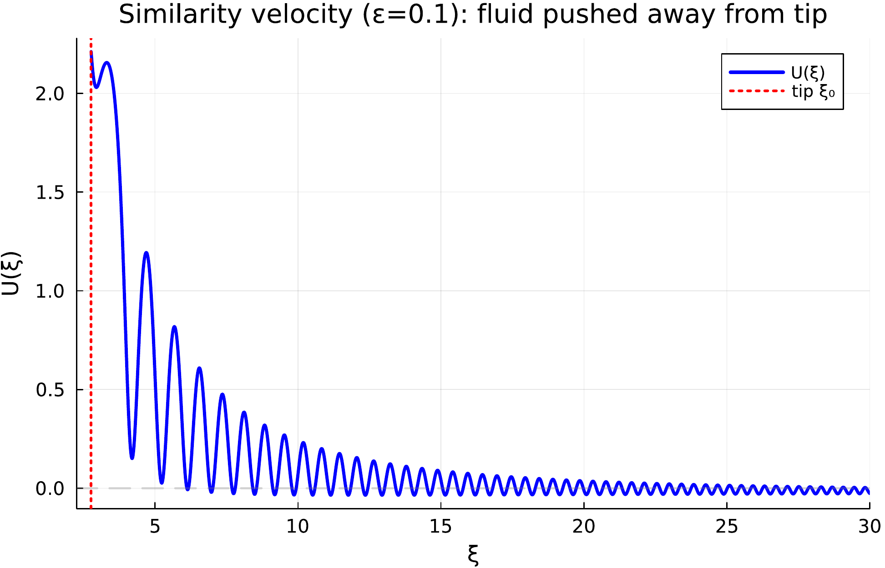
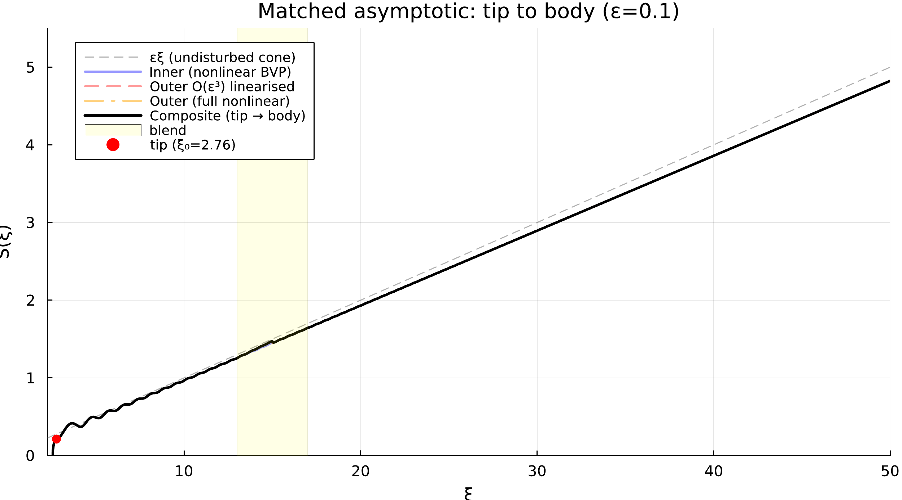

# SlenderConeRecoil.jl

A provisional computational reconstruction of S. P. Decent and A. C. King's surface-tension-driven recoil problem for a slender fluid cone, using Keller--Miksis similarity scaling and local matched-asymptotic-inspired diagnostics. The implementation is currently being reconciled against the primary source ledger in `docs/research/2026-06-01-similarity-methods/06_decent_king_source_ledger.md`; quantitative Decent--King fidelity claims should be treated as provisional until the 2008 article body is available.

## Background

I started a PhD in free boundary problems in fluid dynamics in the late 1990s. The first international conference I attended was the IUTAM Symposium on Free Surface Flows at the University of Birmingham, around 2000, organised by A. C. King and Y. D. Shikhmurzaev. I saw Andy King present the slender cone recoil problem -- modelling the conical tip of a fluid thread just after droplet pinch-off, driven by surface tension, solved via similarity methods and matched asymptotics. The inner nonlinear BVP producing a blob at the tip, the outer linearised capillary wave field, the matching -- it was one of the most impressive pieces of applied mathematics I had encountered. I switched my PhD to quantum computing in 2002, but the problem stayed with me for over two decades. This project is intended to become a faithful computational reproduction and extension of that work, made practical by AI-assisted coding with [Claude Code](https://claude.ai/claude-code).

## The physics

When a droplet pinches off from a liquid thread or jet, the remaining tip is approximately conical with small half-angle $\varepsilon$. Capillary pressure scales as $\gamma/R$, so it is large near the sharp tip and small far away. The resulting pressure gradient drives a recoil flow: the tip rounds off into a blob, and capillary waves propagate backward along the cone body.

There is no imposed length scale. Dimensional analysis gives the Keller--Miksis self-similar scaling: all lengths grow as $\ell(t) = (\gamma t^2/\rho)^{1/3}$. The length scaling and conical far-field assumptions are source-backed by the 2001 precursor and 2008 metadata. The current primitive-variable convention $z = \ell(t)\,\xi$, $R = \ell(t)\,S(\xi)$, $u = \dot\ell(t)\,U(\xi)$, and the resulting $S,U$ ODEs are reconstructed local implementation choices pending the canonical 2008 equations.

The small cone angle $\varepsilon \ll 1$ provides a second simplification. The current local inner solver treats the reconstructed nonlinear similarity ODEs as a boundary-value problem: a 3D damped Newton iteration over the tip position $\xi_0$, tip radius $S_0$, and tip curvature $S''_0$, shooting outward until $S(\xi) \sim \varepsilon\xi$. Far from the tip, the current outer solver uses a candidate linearised ODE driven by the base-state capillary pressure residual. The matching and composite formula are implementation reconstructions, not yet source-confirmed Decent--King 2008 formulae.

## What this code does

The project has four layers, each in its own source file(s):

**Symbolic slender-body algebra** (`src/expr.jl`, `src/series.jl`, `src/slender.jl`, `src/similarity.jl`). A lightweight symbolic CAS -- expression trees with differentiation, substitution, and series expansion in $\varepsilon$ -- encodes and checks parts of the slender-body and similarity algebra used by the current implementation. No dependency on Symbolics.jl; the CAS follows the AST patterns of [TensorGR.jl](https://github.com/tobiasosborne/TensorGR.jl). The primitive equations are reconstructed/local unless the source ledger marks a fact as 2001-backed or 2008-metadata-backed.

**Inner BVP solver** (`src/inner.jl`). Solves the reconstructed nonlinear similarity ODEs as a 4-component system $[S,\, S',\, S'',\, U]$ with the dispersive $S'''$ term from axial curvature. Shooting from the tip with $S'(\xi_0)=0$ (rounded tip), $U(\xi_0)=\tfrac{4}{5}\xi_0$ (local regularity condition), integrated with Rodas5P. Three far-field conditions (slope, velocity, curvature decay) are matched by 3D damped Newton. These conditions and constants are local implementation data, not paper benchmarks.

**Outer solver and matched composite** (`src/outer.jl`, `src/outer_hierarchy.jl`, `src/composite.jl`). The repository contains hand-coded and CAS-assisted checks of a candidate linearised outer ODE using the local ansatz $S = \varepsilon\xi + \varepsilon^3\sigma_1 + \varepsilon^5\sigma_2$, $U = \varepsilon^2\omega_1 + \varepsilon^4\omega_2$. The supported CAS expansion grammar is finite integer-power/Laurent series in $\varepsilon$ with $\varepsilon$-free symbolic coefficients; noninteger powers and functions are allowed only as $\varepsilon$-free coefficients. Source-specific half-integer and multiple-scale oscillatory hierarchies are not implemented. Source-confirmed outer boundary conditions, matching constants, and composite formulae are still blocked on the 2008 article body. The current additive composite uses a fitted linear common part as a local diagnostic construction.

**PDE verification** (`src/pde.jl`). The time-dependent 1D slender model is solved directly by method of lines: 2nd-order finite differences on a tanh-stretched grid, implicit FBDF time integration. Rescaling PDE snapshots to similarity variables is used as an internal consistency check against the computed $S(\xi)$.

## Key results

The figures and numerical values below describe the current implementation outputs. They are not yet paper-verified benchmarks from Decent and King.

### Similarity profile near the tip

The current inner solve produces a local reconstructed blob at $\xi_0 \approx 2.76$ with $S_0 \approx 0.24$, followed by a train of capillary waves that decay toward the undisturbed cone $S = \varepsilon\xi$. These numbers are locally blessed regression values, not source benchmarks.



### Capillary wave structure

The excess $S(\xi) - \varepsilon\xi$ reveals 6--10 local oscillations with amplitude decaying away from the tip. The 2001 precursor and 2008 metadata support the qualitative presence of rapidly oscillating waves; this implementation's count, amplitude, and $S'''$ ordering are still provisional.



### Self-similar recoil in physical space

The similarity solution maps to physical coordinates at any time $t$ via $z = t^{2/3}\xi$, $R = t^{2/3}S$. The blob grows, the capillary waves stretch, and the profile retains its shape under rescaling.



### Axisymmetric tip shape

The recoiled tip at $t = 1.0$, shown as the full axisymmetric body of revolution with hemispherical cap. The blob and first few capillary wave crests are clearly visible.



### Similarity velocity

The reconstructed velocity field $U(\xi)$ peaks near the tip in the current sign convention and oscillates in phase with the capillary waves before decaying to zero. This is an implementation output pending source confirmation.



### Matched asymptotic composite

The current composite blends the local inner solution with the local outer solution to give a single reconstructed profile. The CAS-derived hierarchy is an internal algebra check for the package's current $S,U$ equations. It is limited to the integer/Laurent grammar described above and is not a Decent--King source-backed higher-order hierarchy.



## How to run

Requires Julia 1.10+. The package runtime depends on
DifferentialEquations.jl; figure generation uses the separate `scripts`
environment so plotting does not become a library dependency.
The dependency and optional-extension policy is documented in
[`docs/dependency_policy.md`](docs/dependency_policy.md).

```bash
# Instantiate package and figure-tool environments
julia --project -e 'using Pkg; Pkg.instantiate()'
julia --project=scripts -e 'using Pkg; Pkg.instantiate()'

# Generate all figure PDFs/PNGs and figures/metadata.toml
julia --project=scripts scripts/figures.jl

# Refresh figure metadata only, without regenerating plot binaries
julia --project=scripts scripts/figures.jl --metadata-only

# Run the default fast gate: package/API, symbolic, slender, similarity, hierarchy
julia --project test/runtests.jl

# Run the slow numerical gate: inner/outer/composite/PDE/regression solves
SLENDER_RECOIL_TEST_GROUP=slow julia --project test/runtests.jl

# Run both gates in one Julia process
SLENDER_RECOIL_TEST_GROUP=all julia --project test/runtests.jl

# Run individual beads
julia --project test/test_bead1.jl    # symbolic CAS
julia --project test/test_bead5.jl    # inner BVP solver
julia --project test/test_bead8.jl    # PDE verification
```

Run one Julia package/test job at a time in this project environment. The
solver tests precompile and exercise shared package state, so concurrent fast,
slow, or individual Julia test jobs can race with each other.

Figure generation writes both PDF and PNG versions of each tracked plot from
the same plot object and records the solver/environment metadata in
`figures/metadata.toml`. The figure binaries and metadata file are tracked
reproducibility artifacts.

## File map

| File | Purpose |
|------|---------|
| `src/expr.jl`, `src/expr_ops.jl` | Symbolic expression types, differentiation, display |
| `src/series.jl` | Series expansion in $\varepsilon$, order collection |
| `src/slender.jl` | 1D slender-body model (mass + momentum with curvature) |
| `src/similarity.jl` | Keller--Miksis similarity reduction to ODEs |
| `src/inner.jl` | Inner BVP: 3D Newton shooting, Rodas5P, 4-component ODE |
| `src/outer.jl` | Outer linearised problem, 4-component with $S'''$ |
| `src/outer_hierarchy.jl` | Local integer/Laurent $\varepsilon$-hierarchy check, full nonlinear outer solver |
| `src/composite.jl` | Additive composite matching |
| `src/pde.jl` | Time-dependent PDE: FBDF, non-uniform FD, $R_{zzz}$ |
| `scripts/figures.jl` | All figure generation |

## Known limitations

- Source fidelity is under review. The authoritative status labels are in `docs/research/2026-06-01-similarity-methods/06_decent_king_source_ledger.md`. The intended primary source is Decent and King (2008), *IMA Journal of Applied Mathematics* 73(1), 37--68, DOI `10.1093/imamat/hxm043`; the article body is not yet locally available, and previous documentation incorrectly cited a QJMAM DOI as the cone paper.
- The 3D Newton BVP converges to ~2% far-field slope error. A continuation or homotopy method would improve this.
- The PDE solver is limited to $t \lesssim 0.04$ by stiffness from capillary pressure near the truncated tip. Adaptive mesh refinement would help.
- The higher-order outer CAS is local/internal. It supports only finite integer-power/Laurent $\varepsilon$ expansions around symbolic nonzero leading coefficients; Decent--King source-specific half-integer and multiple-scale oscillatory outer hierarchies are not implemented.

## References

- S. P. Decent and A. C. King, "Surface-tension-driven flow in a slender cone," *IMA Journal of Applied Mathematics* **73**(1), 37--68, 2008. [doi:10.1093/imamat/hxm043](https://doi.org/10.1093/imamat/hxm043)
- S. P. Decent and A. C. King, "The Recoil of A Broken Liquid Bridge," in *IUTAM Symposium on Free Surface Flows*, Springer, 2001.
- J. Billingham, "Surface-tension-driven flow in fat fluid wedges and cones," *J. Fluid Mech.* **397**, 45--71, 1999.
- J. B. Keller and M. J. Miksis, "Surface tension driven flows," *SIAM J. Appl. Math.* **43**(2), 268--277, 1983.
- J. Eggers, "Nonlinear dynamics and breakup of free-surface flows," *Rev. Mod. Phys.* **69**, 865--929, 1997.

## Acknowledgement

This project was built with [Claude Code](https://claude.ai/claude-code) (Anthropic).
